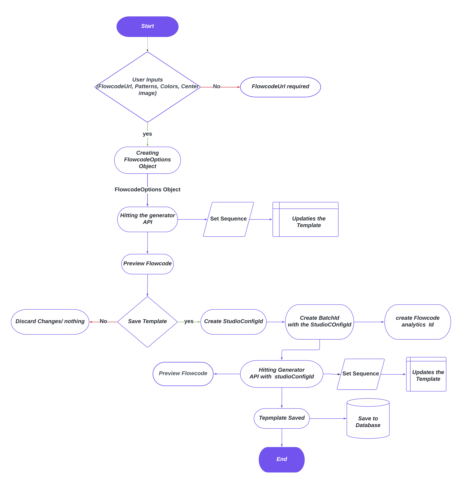

# Flowcode Generation

Instruction for setting up Flowcode generation process.

---

**Table of Contents:**

1. [Getting Started](#getting-started)
   1. [Installation of the packages](#installation-of-the-packages)
   2. [Setting up envirnment variables for accessing the private package](#setting-up-envirnment-variables-for-accessing-the-private-package)
2. [Workflow](#workflow)
3. [Importing types and objects](#importing-types-and-objects)
4. [Making FlowcodeOptions object](#making-flowcodeoptions-object)
5. [Previewing flowcode](#previewing-flowcode)
6. [Creating flowcode](#creating-flowcode)
   1.[Create StudioConfigId](#create-studioconfigid)
   2.[Create BatchID](#create-batchid)
7. [Finishing up the process](#finishing-up-the-process)
8. [Outro](#outro)

---

##Getting Started

Welcome! to get started for Flowcode Generation, You need to install some packages first.

After that, you need to create environmental varible to access the package credential for the `@flowcode/flowcode-generator-types` private package.

####Installation of the packages

```bash
yarn add "@flowcode/flowcode-generator-types": "1.1.3"

yarn add random-seed
```

####Setting up envirnment Variables for accessing the private package

Firstly, you need to add these follwing lines in .npmrc file.
These lines includes environment varibles for accessing the private package credentials.

```bash
always-auth=true
@dtx-company:registry=https://npm.pkg.github.com
@flowcode:registry=https://flowcode.jfrog.io/artifactory/api/npm/fc-npm/
//flowcode.jfrog.io/artifactory/api/npm/fc-npm/:_password=${JFROG_FC_NPM_PASSWORD_B64}
//flowcode.jfrog.io/artifactory/api/npm/fc-npm/:username=${JFROG_FC_NPM_USERNAME}

```

Now you need to set these environment varibales `JFROG_FC_NPM_USERNAME` and `JFROG_FC_NPM_PASSWORD_B64` in you local machine.

>See on google that how to setup environment varibles in your local machine (Mac/Linux/windows).

>Ask Flowcode team for the values of these variables.

>If you are using `Docker`, You need to check how to set environment varibales in Docker.

---

##Workflow

Here is the workflow of flowcode generation process.

This documentation is based on this workflow and its in the sequence

[](https://lucid.app/lucidchart/a90169c8-40ab-4a27-bd36-dba6bfc3dc46/edit?viewport_loc=662%2C-86%2C4819%2C2575%2C0_0&invitationId=inv_13b7b8cc-272b-4035-a5c0-1126810e9e69#)

---
##Importing types and objects

You need import types and objects inorder to create flocodeGenerationOptions Object.

```js
import {
    FcShape,
    FcText,
    FcGeneratorPositionElementOptions,
    FcPositionProperty,
    FcPosition,
    FcColorBlack,
    FcGeneratorOptions,

 } from '@flowcode/flowcode-generator-types'


 const tvCodeSizeOptions = {
 outerShapeOutlineSize: 0,
 innerShapeWidth: 45,
 outerShapeWidth: 15,
 insetBorderPadding: 0.11
}
const logoEyesStyle: FcGeneratorPositionElementOptions = {
 ...tvCodeSizeOptions,
 outerShape: FcShape.LOGO,
 innerShape: FcShape.SQUARE,
 text: {
   text: 'FLOWCODE',
   font: 'inter_black',
   fontColor: '#000000',
   fontSize: 12,
   position: { property: FcPositionProperty.DEFAULT, offsetPercentage: 0 }
 }
}
const otherEyesStyle: FcGeneratorPositionElementOptions = {
 ...tvCodeSizeOptions,
 outerShape: FcShape.SQUARE,
 innerShape: FcShape.SQUARE
}
const tvCodeOptions: FcGeneratorOptions = {
  data:"https://flowcode.com/p/",
 isTVCode: true,
 containerBackgroundInsetExtend: 4,
 qrdensity: 4,
 containerBorderSize: 7.5,
 containerBorderInsetEyes: 7,
 dataGridPercentageSize: 72,
 radiusMask: 78,
 containerRimPatternSize: 85,
 containerEmptySpaceSize: 6,
 containerText: [
   new FcText(
     'PRIVACY.FLOWCODE.COM',
     'inter_medium',
     7,
     FcColorBlack,
     new FcPosition(FcPositionProperty.BOTTOM, 2)
   )
 ]
}
export const TV_CODE_FLOWCODE_OPTIONS: FcGeneratorOptions = {
 ...tvCodeOptions,
 qrrotate: false,
 positionElementTopRight: otherEyesStyle,
 positionElementBottomLeft: logoEyesStyle,
 positionElementTopLeft: otherEyesStyle
}
export const TV_CODE_FLOWCODE_OPTIONS_ROTATED_EYES: FcGeneratorOptions = {
 ...tvCodeOptions,
 qrrotate: true,
 positionElementTopRight: logoEyesStyle,
 positionElementBottomLeft: otherEyesStyle,
 positionElementTopLeft: otherEyesStyle
}
export const getChangedColorTvCode =(color:string)=>{
  if(color){
    return{
      ...TV_CODE_FLOWCODE_OPTIONS,
      containerBorderColor:color,
      containerOuterPatternColor:color,
      gridModuleColor:color,
      positionElementTopLeft:{
       ...TV_CODE_FLOWCODE_OPTIONS.positionElementTopLeft,
       innerShapeColor:color,
       outerShapeColor:color,
      },
      positionElementTopRight:{
        ...TV_CODE_FLOWCODE_OPTIONS.positionElementTopLeft,
        innerShapeColor:color,
        outerShapeColor:color,
       },
       positionElementBottomLeft:{
        ...TV_CODE_FLOWCODE_OPTIONS.positionElementTopLeft,
        innerShapeColor:color,
        outerShapeColor:color,
       },
       containerText: [
        new FcText(
          'PRIVACY.FLOWCODE.COM',
          'inter_medium',
          7,
          color,
          new FcPosition(FcPositionProperty.BOTTOM, 2)
        )
      ]

    }
  }
}
```

>These are the deafult options for flowcode Options. The main two objects are `TV_CODE_FLOWCODE_OPTIONS` and `TV_CODE_FLOWCODE_OPTIONS_ROTATED_EYES`. 

---

## Making FlowcodeOptions object

For making the flowcode options object, it will depende on the parameter of the user . for expample user can select different pattern, colors, centerImgae. etc .
depending on the user Input the value of the deafult objects will change and create a new object . the code is given in the following.

```js
const tvFlowcodeOptions = useMemo(() => {
  const isInverted=false;
  const rotateEyes = true;
  const backgroundColor=selectedColor?.code;
  const gridModuleShape= +selectedPattern?.id
  const invertedColorOpts = getInvertedColorTvCodeProps(rotateEyes, backgroundColor || '')
  const changedColors=getChangedColorTvCode(backgroundColor);
  const standardOpts = rotateEyes
    ? TV_CODE_FLOWCODE_OPTIONS
    : TV_CODE_FLOWCODE_OPTIONS_ROTATED_EYES
  // TODO = look into better way to distinguish between different shapes
  const customShape = !rotateEyes ? 'heart' : undefined
  const gridModuleSize = getGridModuleSizeForTVCode(gridModuleShape || customShape)

  return {
    ...(isInverted ? invertedColorOpts : changedColors !== null? changedColors: standardOpts),
    gridModuleRandomSizes: gridModuleSize,
    containerOuterPatternRandomSizes: gridModuleSize
  }
}, [selectedPattern, selectedColor])
```

>This tvFlowcodeOptions object will change depending on user input pattern and color

to Support thesese changes there are few function you need to make to adjust the value that need to change

```js
export const getChangedColorTvCode =(color:string)=>{
  if(color){
    return{
      ...TV_CODE_FLOWCODE_OPTIONS,
      containerBorderColor:color,
      containerOuterPatternColor:color,
      gridModuleColor:color,
      positionElementTopLeft:{
       ...TV_CODE_FLOWCODE_OPTIONS.positionElementTopLeft,
       innerShapeColor:color,
       outerShapeColor:color,
      },
      positionElementTopRight:{
        ...TV_CODE_FLOWCODE_OPTIONS.positionElementTopLeft,
        innerShapeColor:color,
        outerShapeColor:color,
       },
       positionElementBottomLeft:{
        ...TV_CODE_FLOWCODE_OPTIONS.positionElementTopLeft,
        innerShapeColor:color,
        outerShapeColor:color,
       },
       containerText: [
        new FcText(
          'PRIVACY.FLOWCODE.COM',
          'inter_medium',
          7,
          color,
          new FcPosition(FcPositionProperty.BOTTOM, 2)
        )
      ]

    }
  }
}
export const getInvertedColorTvCodeProps = (
 isRotated: boolean,
 backgroundColor: string
): FcGeneratorOptions => {
 if (isRotated) {
   return {
     ...TV_CODE_FLOWCODE_OPTIONS_ROTATED_EYES,
     positionElementTopRight: {
       ...logoEyesStyle,
       backgroundColor
     },
     positionElementTopLeft: {
       ...otherEyesStyle,
       backgroundColor
     },
     positionElementBottomLeft: {
       ...otherEyesStyle,
       backgroundColor
     }
   }
 } else {
   return {
     ...TV_CODE_FLOWCODE_OPTIONS,
     positionElementTopRight: {
       ...otherEyesStyle,
       backgroundColor
     },
     positionElementTopLeft: {
       ...otherEyesStyle,
       backgroundColor
     },
     positionElementBottomLeft: {
       ...logoEyesStyle,
       backgroundColor
     }  
   }
 }
}
export const getGridModuleSizeForTVCode = (shape?: FcShape | 'heart'): string => {
 switch (shape) {
   case FcShape.SQUARE:
     return '80'
   case FcShape.SHAGGY:
     return '101'
   case 'heart':
   case FcShape.CIRCLE:
     return '95'
   default:
     return '125'
 }
}
```

> You need make you own funtions and changing parameters if needed.

---

##Previewing flowcode

To Preview the flowcode after the input is taken from the user , the above object need to pass in the url to get the generated flowcode preview

for previewing the flowcode, the Url is `https://stg-generator.dtxcloud.com/v1/flowcode?opts=${encodeURIComponent(JSON.stringify(tvFlowcodeOptions))}` thats for `Stagging` and correspondingly
`https://generator.dtxcloud.com/v1/flowcode?opts=${encodeURIComponent(JSON.stringify(tvFlowcodeOptions))}`for `Production` environment

You need to make http call to make these requests.

---

##Creating Flowcode

Inorder to create Flowcode,
 1.We need to generate StudioConfigId.To get customized designed flowcode.
 2.We need to generate batchId .To generate BatchId , We have use that Studioconfig Id. batchId is needed to keep track of the flowcode anayltics and thats how a flowcode is created. 
 3.We need to call the generator api with that generated studioConfigId to get the flowcode Image.


####Create StudioConfigId

In order to create StudioConfigId , we need to call graphql api called `https://api.stg.flowcode.com/graphql` and there is a mutation called createStudioConfigId.

We need to pass three aruments.
 1. configuration = FlowcodeOptionsObject
 2. name =Flowcode Url
 3. source= "DIY"(default)

The mutation query and response will look like the following 

```graphql

mutation createStudioConfig {
  createStudioConfig(configuration: "{\"data\":\"https://flowcode.com/p/50JKXaba0\",\"qrrotate\":false,\"logoWidth\":0,\"logoHeight\":0,\"radiusMask\":78,\"containerText\":[{\"text\":\"PRIVACY.FLOWCODE.COM\",\"font\":\"inter_medium\",\"fontSize\":7,\"fontColor\":\"#000\",\"position\":{\"property\":7,\"offsetPercentage\":2}}],\"containerShape\":1,\"gridModuleColor\":\"#00000\",\"gridModuleShape\":1,\"gridModuleImageUrl\":null,\"containerBorderSize\":7.5,\"containerBorderColor\":\"#000000\",\"errorCorrectionLevel\":2,\"gridModuleRandomSizes\":\"85\",\"dataGridPercentageSize\":72,\"gridModuleColorFillSvg\":false,\"positionElementTopLeft\":{\"outerShapeOutlineSize\":0,\"innerShapeWidth\":45,\"outerShapeWidth\":15,\"insetBorderPadding\":0.11,\"outerShape\":2,\"innerShape\":2},\"containerEmptySpaceSize\":6,\"positionElementTopRight\":{\"outerShapeOutlineSize\":0,\"innerShapeWidth\":45,\"outerShapeWidth\":15,\"insetBorderPadding\":0.11,\"outerShape\":2,\"innerShape\":2},\"containerImageUrlOpacity\":1,\"positionElementBottomLeft\":{\"outerShapeOutlineSize\":0,\"innerShapeWidth\":45,\"outerShapeWidth\":15,\"insetBorderPadding\":0.11,\"outerShape\":5,\"innerShape\":2,\"text\":{\"text\":\"FLOWCODE\",\"font\":\"inter_black\",\"fontColor\":\"#000000\",\"fontSize\":12,\"position\":{\"property\":0,\"offsetPercentage\":0}}},\"containerOuterPatternColor\":\"#000000\",\"containerOuterPatternShape\":1,\"containerImageBackgroundOnly\":false,\"containerImageOverlayPrivacy\":true,\"containerOuterPatternImageUrl\":null,\"containerBackgroundInsetExtend\":4,\"containerOuterPatternRandomSizes\":\"85\",\"containerOuterPatternColorFillSvg\":false,\"logoImageUrl\":\"\",\"defaultColor\":\"#FF0000\",\"alwaysUseDefaultColor\":true,\"isTVCode\":true,\"qrdensity\":4,\"containerBorderInsetEyes\":7,\"containerRimPatternSize\":85}", source: DIY, name: "DIY-F20-TEST"){
    studioConfig {
      id
    }
  }
}
​
### result
{
  "data": {
    "createStudioConfig": {
      "studioConfig": {
        "id": "U3R1ZGlvQ29uZmlnT2JqZWN0VHlwZTpjYTk0N2EyMS05YTgxLTRmYTgtOWI2MC1kZDQ3YzY2ZTY5NWM="
      }
    }
  }
}
```
The above base64 decoded id is StudioConfigObjectType:ca947a21-9a81-4fa8-9b60-dd47c66e695c which is the global id for the created object.

The id is then used in createBatch to build as many codes as you would like with the same design.

NOTE: when we create codes with the same design we usually create a new studio_config_object so that when a user edits a design they don't affect all of the codes.

---

####Create BatchId

After creating the studioConfigId for designed flowcode , we need to create batchid using that studioConfigId to create and register the flowcode at Flowcode.com

Creating batchId is similar process of creating studioConfigId because both are graphql api just parameters are different.

The parameters are given bellow
 
 - active: Boolean = true
 - anonymousSessionId: UUID
- assetLabels: [String]
- campaignName: CombinedGeneratorCampaigns
- creationSource: CreationSource
- isCollectible: Boolean = false
- isStaticCode: Boolean = false
- nickname: String = ""
- partialIds: [UUID] = []
- redirectDomain: String
- redirectType: RedirectType!
- studioConfigId: UUID
- url: String!
- userId: ID

A snippet of the query and response are given bellow.

```graphql
### createBatch request
mutation createBatch {
  createBatch(studioConfigId: "ca947a21-9a81-4fa8-9b60-dd47c66e695c", redirectType: URL, url: "test.com", creationSource: VIDEO_TOOL) {
    ok
    batch{
      id
    }
  }
}
### result
{
  "data": {
    "createBatch": {
      "ok": true,
      "batch": {
        "id": "QmF0Y2hEamFuZ29UeXBlOmVSWHFH"
      }
    }
  }
}
```
Use This batch Id the identify the flowcode in flowcode analytics page.
we can see the how many scans are made, when it is created, which user etc in tha analytics

---

##Finishing up the process

After creating the studioConfig Id and batch Id , we need to get the flowcode image to use it but this the the generator api and the parameter will be diffrent.

we need to call `https://stg-generator.flowcode.com/v1/flowcode?` api and add `&data=(encodedUriComponent(flowcodeUrl))` and `&studio_config_id=studioConfigId`
to get desired image with desired flowcode url.

> You need to adjust those logics according to your code structure.

---

##Outro

This whole process is slef documented by Shabab Hossain Rhythm.

For any queries and changes pleade contact to shabab.hossain@ixorasolution.com